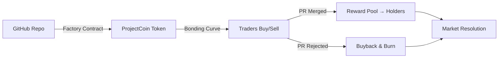

# GitGuild

**Decentralized prediction markets for GitHub pull requests. Built on a moving train — 3rd place @ BlockTrain hackathon.**

<p align="center">
  
  
  
  
  
</p>

---

## What It Does

GitGuild lets anyone create and trade prediction markets for GitHub pull requests. Each PR gets its own token with bonding curve pricing — early traders get better prices, and when a PR merges, token holders get paid.

Open source development lacks market signals. Maintainers can't tell which PRs the community actually wants merged. Contributors can't tell if their work will be accepted. GitGuild bridges that gap with economic incentives.

---

## How It Works



### Bonding Curve Economics

| Action | Price | Outcome |
|--------|-------|---------|
| Early buyer | 0.001 ETH per 1000 tokens | Lower entry, higher upside |
| Later buyer | 0.002 ETH per 1000 tokens | Higher entry reflects demand |
| PR merges | — | Reward pool distributed to holders |
| PR rejected | — | Buyback and burn — deflationary pressure |

### Fee Distribution

| Allocation | Share | Purpose |
|------------|-------|---------|
| Reward Pool | 50% | Paid out when PRs resolve |
| Treasury | 30% | Platform development |
| Buyback Fund | 20% | Token burns to manage supply |

---

## Architecture

```
GitGuild/
├── blockchain/              # Smart contracts (Solidity + Hardhat)
│   ├── contracts/
│   │   ├── ProjectCoinFactory.sol    # Creates PR-specific tokens
│   │   └── ProjectCoin.sol           # ERC20 with bonding curve
│   ├── test/                # Contract tests
│   └── scripts/             # Sepolia deployment
│
├── frontend/                # Next.js 14 + TypeScript
│   ├── src/
│   │   ├── app/             # Pages (market discovery, trading, portfolio)
│   │   ├── components/      # Wallet connect, token cards, charts
│   │   ├── hooks/           # Wagmi + GitHub API hooks
│   │   └── lib/             # Web3 utils, contract ABIs
│   └── package.json
│
└── docs/                    # SETUP.md, USAGE.md, DEPLOYMENT-CHECKLIST.md
```

---

## Tech Stack

| Layer | Technology |
|-------|-----------|
| **Smart Contracts** | Solidity 0.8.28, OpenZeppelin, Hardhat |
| **Frontend** | Next.js 14, TypeScript, Wagmi, Viem, Tailwind CSS |
| **Blockchain** | Sepolia testnet, MetaMask |
| **Data** | GitHub REST API, React Query |

---

## Quick Start

```bash
git clone https://github.com/Muneer320/GitGuild.git
cd GitGuild

# Smart contracts
cd blockchain && npm install
npx hardhat test

# Frontend
cd ../frontend && npm install
npm run dev
```

Requires MetaMask with Sepolia ETH and a GitHub personal access token.

---

## Why GitGuild Exists

**The problem:** Open source maintainers review 10-50 PRs a week with no signal on which ones the community actually wants merged. Contributors spend weeks on PRs that get rejected. The only feedback loop is the maintainer's personal judgement.

**The solution:** Let the crowd signal quality through economic incentives. A PR with high trading volume and rising token price is one the community believes in. A PR with flat or falling price signals problems before the maintainer even looks at it.

---

## The BlockTrain Story

Built at **BlockTrain** — India's first moving Ethereum hackathon organized by Devfolio. 5,000+ applicants, 45 builders selected, 36 hours on a train from Bengaluru to New Delhi.

Limited internet, an onboard intranet with local npm packages, mentors rotating through berths. 21 projects shipped. GitGuild placed 3rd.

*Sponsored by Base, Noice, and Geode.*

---

## Documentation

| Document | Purpose |
|----------|---------|
| [SETUP.md](./SETUP.md) | Environment setup and prerequisites |
| [USAGE.md](./USAGE.md) | How to create and trade markets |
| [DEPLOYMENT-CHECKLIST.md](./DEPLOYMENT-CHECKLIST.md) | Sepolia deployment steps |

---

## License

MIT © Muneer Alam